# 프로젝트 목록    
 

##### 교육 과정중 수행했던 총 4건의 프로젝트에 대한 포트폴리오
- **ATmega128A를 이용한 선풍기제어**
- **STM32을 사용한 Elevator의 제어** 
- **STM32 BT 기반 RC카 제어 시스템**
- **FPGA, Verilog를 활용한 Smart Pot** 

---

## ATmega128 이용 선풍기 제어
###### **[목적] :** 학습 과정 중에 습득한 개념 활용과 검증 
 

##### 기능설명
| 구현 기능   | 설명                                                |
|-------------|-----------------------------------------------------|
| 팬속도 제어 | **PWM** 과 **Timer** 활용 3단계(약/중/강) 속도 조절 |
| 회전 기능   | **서보모터** 와 **PWM** 좌우 자동 회전 ON/OFF       |
| 버튼 제어   | 매 버턴 선택시  관련 동작 수행                      |
| FND 출력    | 현재 상태 및 설정 표시                              |

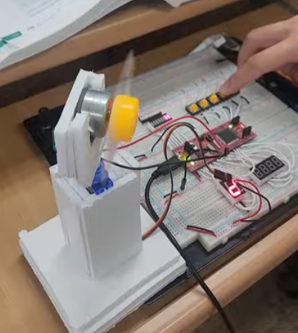
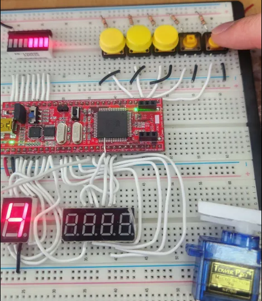
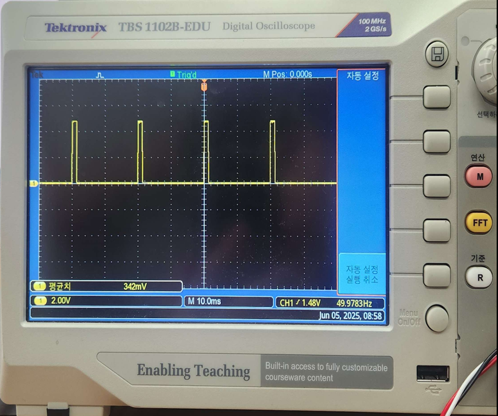
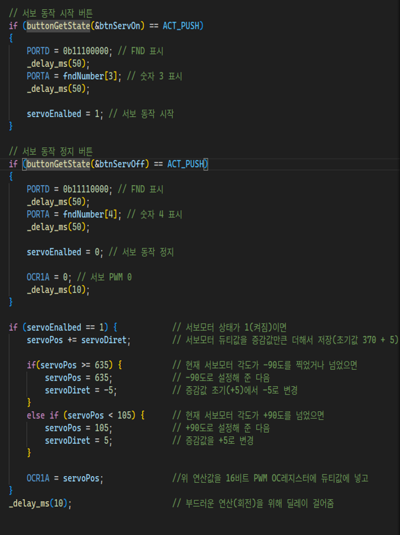

---

## STM32을 사용한 Elevator의 제어
###### **[목적] :** Elevator의 제어 기능 학습을 통한 STM32 사용법 습득 
 

###### Elevator의 동작 상태도
- **초기상태**   : 시스템이 시작되는 상태  
- **운행중상태** : 엘리베이터가 이동 중인 상태
- **정지중상태** :엘리베이터가 멈춰있는 상태  

| 초기 상태 (Power On)    |운행 중 상태            |정지 중 상태               |
|-------------------------|------------------------|---------------------------|
|1. 저장장치 제약사항 처리| 1. 층 인식 과정        |1. 정지상태 감지 방식      |
|2. 초기화 과정           | 2. 층 이동 방향 처리   |2. 층 정보 확인 (포토)     |
|3. 현재위치 파악         | 3. 정지조건 처리       |3. 층 정보 입력처리 |
|4. 정지중 상태 전환      | 4. 운행중 안전제약 처리|4. 이동 방향 결정 처리     |

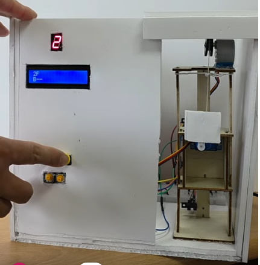
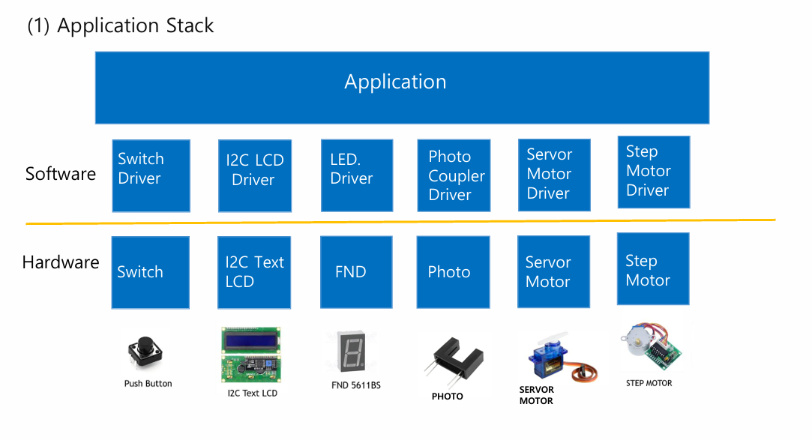
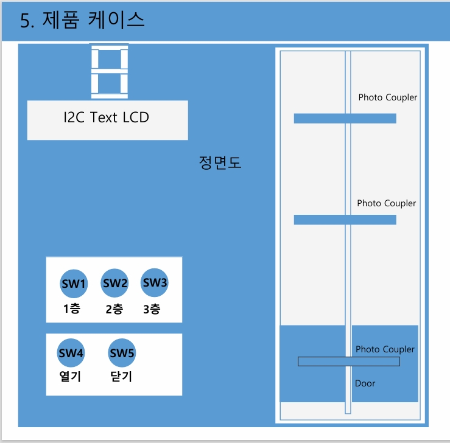
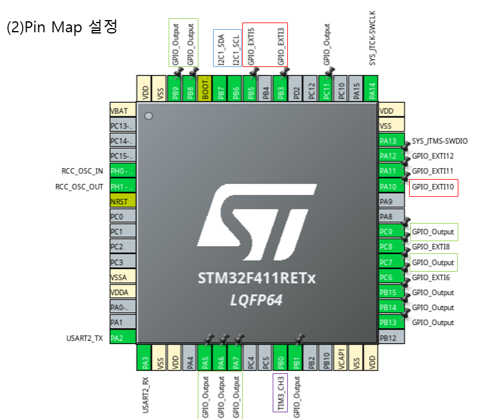

---

## STM32 BT 기반 RC카 제어 시스템
###### **[목적] :** 학습한 ARM 기반 임베디드 개념 과 활용 
 

###### UART 통신과 BT  모터 수동 제어
- ㄴ

###### 전방 초음파센서 3개를 활용한 주행알고리즘 설계 
- ㄴ

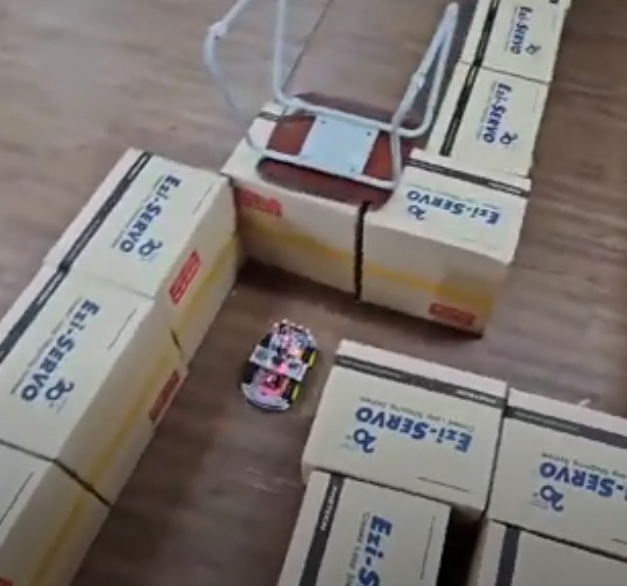
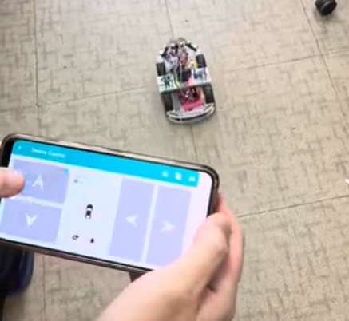
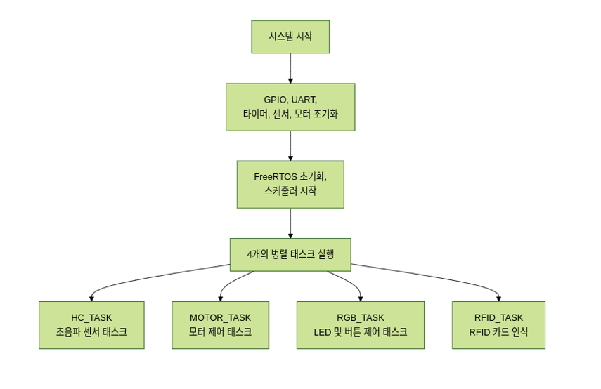
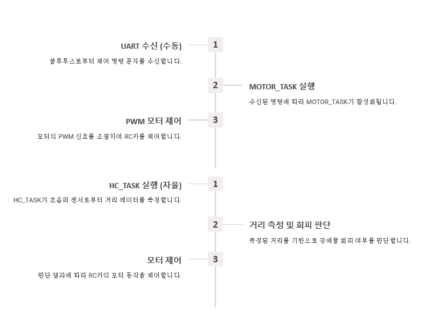

---

## FPGA, Verilog를 활용한 Smart Pot
###### **[목적] :** 학습 과정 중에 습득한 개념 활용과 검증 
 

##### 기능설명
| 구현 기능   | 설명                                                |
|-------------|-----------------------------------------------------|
| 팬속도 제어 | **PWM** 과 **Timer** 활용 3단계(약/중/강) 속도 조절 |
| 회전 기능   | **서보모터** 와 **PWM** 좌우 자동 회전 ON/OFF       |
| 버튼 제어   | 매 버턴 선택시  관련 동작 수행                      |
| FND 출력    | 현재 상태 및 설정 표시                              |

--- 
<!-- _class: lead -->
<!-- _paginate: skip -->

# 감사합니다

세미콘 설계/검증 아카데미 
**한상진**